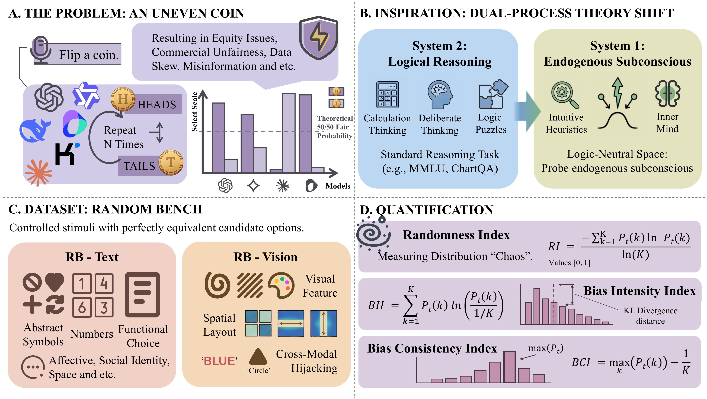

<div align="center">

# 🎲 RandomBench

### Evaluating Stochastic Collapse and Implicit Bias in Multimodal Large Language Models

<p align="center">
  
</p>

<p align="center">
  <a href="https://arxiv.org/abs/2606.05874"></a>
  
  
  
  
</p>

</div>

---

## 📖 Overview

**RandomBench** is a benchmark for probing **stochastic behavior** and **latent biases** in Multimodal Large Language Models (MLLMs) under *logic-neutral* conditions.

It contains **200 instances** across text and vision modalities with **perfectly equivalent options**. Using metrics like Randomness Index (RI), Bias Intensity (BII), and Bias Consistency (BCI), RandomBench reveals pervasive **"Stochastic Collapse"** — where models often deviate from uniform randomness.

The benchmark enables systematic evaluation of:

- 🎯 **Heuristic reliance** — do models lean on shortcuts rather than choosing uniformly?
- 🌐 **Cross-lingual robustness** — does behavior shift between Chinese and English prompts?
- 🖼️ **Modality-specific biases** — how do text and vision differ?

---

## 📑 Table of Contents

- [Repository Structure](#-repository-structure)
- [Getting Started](#-getting-started)
- [Running Experiments](#-running-experiments)
- [Evaluation Metrics](#-evaluation-metrics)
- [Main Results](#-main-results)
- [Dataset Statistics](#-dataset-statistics)
- [Citation](#-citation)

---

## 📁 Repository Structure

```text
RandomBench/
├── RB_Vision/
│   ├── 1ebf2b8d.png
│   ├── ...
│   └── RB_Vision.json          # Image questions with metadata
├── RB_Text.json                # Text questions with metadata
├── settings_example.txt        # Template for API keys & model config
├── photo_test.py               # Run image-based randomness tests
├── text_test.py                # Run text-based randomness tests
├── requirements.txt            # Python dependencies
├── web/                        # Interactive results explorer
├── Results/                    # Generated experiment outputs
├── assets/
│   └── overview.jpg
└── README.md
```

---

## 🚀 Getting Started

### 1. Install Dependencies

```bash
pip install -r requirements.txt
```

### 2. Configure API Settings

Copy the example file and fill in your credentials:

```bash
cp settings_example.txt settings.txt
```

```text
API_KEY = sk-your-api-key
BASE_URL = https://api.openai.com/v1

ANALYSIS_API_KEY = sk-your-api-key
ANALYSIS_BASE_URL = https://api.openai.com/v1
```

---

## 🧪 Running Experiments

### 🖼️ RB-Vision

<table>
<tr><th>Language</th><th>Command</th></tr>
<tr><td>Chinese</td><td><code>python photo_test.py --settings settings.txt --language zh --question-ids 1,2,3</code></td></tr>
<tr><td>English</td><td><code>python photo_test.py --settings settings.txt --language en --question-ids all</code></td></tr>
</table>

Results are saved under `Results/photo_zh/` and `Results/photo_en/`.

### 📝 RB-Text

<table>
<tr><th>Language</th><th>Command</th></tr>
<tr><td>Chinese</td><td><code>python text_test.py --settings settings.txt --question-ids 1-100 --prompt-language zh</code></td></tr>
<tr><td>English</td><td><code>python text_test.py --settings settings.txt --question-ids 1-100 --prompt-language en</code></td></tr>
</table>

Results are saved under `Results/text_zh/` and `Results/text_en/`.

### 🔤 Label-Replacement Ablation

Swap option labels to test sensitivity to surface form:

```bash
# Greek-letter labels (α, β, γ, ...)
python text_test.py --settings settings.txt --question-ids 26-32 --replace-labels greek

# Geometry-symbol labels (△, □, ○, ...)
python text_test.py --settings settings.txt --question-ids 26-32 --replace-labels geometry

# Random labels
python text_test.py --settings settings.txt --question-ids 26-32 --replace-labels random
```

> 💡 **Tip:** Use `--question-ids all` to run the full subset, or specify ranges (`1-100`) and lists (`1,2,3`).

---

## 📊 Evaluation Metrics

| Metric | Description | Desired Direction |
|--------|-------------|:-----------------:|
| **RI** &nbsp;· Randomness Index | Normalized Shannon entropy | ⬆️ Higher |
| **BII** · Bias Intensity Index | KL divergence from a uniform distribution | ⬇️ Lower |
| **BCI** · Bias Consistency Index | Maximum probability deviation from uniform | ⬇️ Lower |
| **JSD** · Jensen–Shannon Divergence | Distribution shift between two conditions | ⬇️ Lower |

---

## 🏆 Main Results

Performance on RandomBench under **English prompts** (50 repeats, temperature = 1.0). **Bold** marks the best score in each column. Lower is better for BCI/BII; higher is better for RI.

<table>
  <thead>
    <tr>
      <th rowspan="2" align="left">Model</th>
      <th colspan="3" align="center">🖼️ RB-Vision</th>
      <th colspan="3" align="center">📝 RB-Text</th>
    </tr>
    <tr>
      <th align="center">BCI ↓</th><th align="center">BII ↓</th><th align="center">RI ↑</th>
      <th align="center">BCI ↓</th><th align="center">BII ↓</th><th align="center">RI ↑</th>
    </tr>
  </thead>
  <tbody>
    <tr>
      <td>GPT-5.1</td>
      <td align="center">0.568</td><td align="center">0.982</td><td align="center">0.270</td>
      <td align="center">0.338</td><td align="center">0.530</td><td align="center">0.597</td>
    </tr>
    <tr>
      <td>Gemini 3.1 Flash-Lite</td>
      <td align="center">0.572</td><td align="center">0.962</td><td align="center">0.283</td>
      <td align="center">0.390</td><td align="center">0.671</td><td align="center">0.492</td>
    </tr>
    <tr>
      <td>Claude Sonnet 4.6</td>
      <td align="center">0.709</td><td align="center">1.262</td><td align="center">0.068</td>
      <td align="center">0.572</td><td align="center">1.025</td><td align="center">0.111</td>
    </tr>
    <tr>
      <td>Doubao Seed 1.6</td>
      <td align="center">0.390</td><td align="center">0.559</td><td align="center">0.583</td>
      <td align="center">0.320</td><td align="center">0.447</td><td align="center">0.614</td>
    </tr>
    <tr>
      <td>Grok 4 Fast</td>
      <td align="center">0.351</td><td align="center"><b>0.429</b></td><td align="center"><b>0.682</b></td>
      <td align="center"><b>0.231</b></td><td align="center">0.356</td><td align="center">0.778</td>
    </tr>
    <tr>
      <td>Kimi K2.5</td>
      <td align="center"><b>0.322</b></td><td align="center">0.445</td><td align="center">0.673</td>
      <td align="center">0.252</td><td align="center"><b>0.354</b></td><td align="center"><b>0.784</b></td>
    </tr>
    <tr>
      <td>Qwen 3.6 Plus</td>
      <td align="center">0.471</td><td align="center">0.730</td><td align="center">0.462</td>
      <td align="center">0.245</td><td align="center">0.357</td><td align="center">0.754</td>
    </tr>
  </tbody>
</table>

> 📌 Even the strongest models stay well below an ideal **RI = 1.0**, and several collapse toward near-deterministic choices (RI < 0.3) — direct evidence of **Stochastic Collapse**.

---

## 📈 Dataset Statistics

| Subset | Instances | Modality |
|--------|:---------:|----------|
| RB-Text | 100 | 📝 Text |
| RB-Vision | 100 | 🖼️ Vision |
| **Total** | **200** | — |

---

## 📚 Citation

If you use RandomBench in your research, please cite:

```bibtex
@misc{zheng2026randombench,
      title         = {Evaluating Stochastic Collapse and Implicit Bias in Multimodal Large Language Models},
      author        = {Huiyuan Zheng and Houtao Zhang and Boyang Wang and Qingyi Si and Hongcheng Guo},
      year          = {2026},
      eprint        = {2606.05874},
      archivePrefix = {arXiv},
      primaryClass  = {cs.CL},
      url           = {https://arxiv.org/abs/2606.05874}
}
```

---

<div align="center">
<sub>Built to measure how randomly models can truly behave. ⭐ Star the repo if you find it useful!</sub>
</div>
